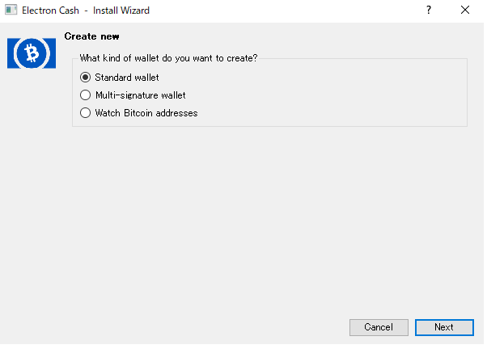

ここ数日、圧倒的勢いでビットコインキャッシュ（BCH）が値上がりしています。
そこで気になるのが分裂後特に気にもせず各種ウォレットに放置されているBCHたち。
8月の時点でBCHの価値向上や値上がりを予想していた人は少なかったと思いますので、放置されたBCHは多いのではないかと思います。
私も、IndieSquareというウォレットに8月の分裂当時0.1 BTC入れていましたが、額が少ないこともあり気にしていませんでした。
しかしながら、今現在の価値で計算すると0.1 BTCでも数万円、ちょっと無視したくない金額です。
そもそも、IndieSquareにはBCHが表示されないので、画面だけ見ていると本当にBCHがあるのかよくわかりません。（あとで説明しますが、ちゃんとあります！）
まずはそのあたりから調べてみましょう。そして他のウォレットに送金できるところまで確認しましょう。

今回はIndieSquareを使って説明しますが、他のウォレットでも基本的な考え方は同じですので、調べる際の参考にでもなればと思います。

## IndieSquare発行アドレスのBCHを確認する

BlockChairというサイトで、アドレスのBCH保持量を確認できます。このサイトにIndieSquareのアドレスを入力して、BCHがあることを確認しましょう。  
https://blockchair.com/

[私のウォレット](https://blockchair.com/bitcoin-cash/address/16ChynQi7CDP3XMLrok8mGQeZHPmarrFM5)  

大体0.0098 BCHがあることが確認できました。確かに0.1 BTC入れて、多少送金手数料で使ったので、このアドレスにはこの程度入れていたはずです！  
このアドレスにBCHがあることがわかりましたが、IndieSquareアプリからBCHを送金することはできません。  
次は他のウォレットを使い送金できるようにしましょう。  

## Electrumに秘密鍵をインポートする  

### Electrum Cashをダウンロードする

私はBCH用WalletにElectrum Cashを使うことにしました。  
BTC用のElectrumを用いていると上書きされてしまうなどの不具合があるようですが、私は初めて使うので問題ないためこれにしました。  
もし以前にElectrumを使ったことがある場合は他のWalletを使うほうが安全かもしれません。  

https://electroncash.org/

ダウンロード後、実行前に必ずハッシュを確認します！  
ハッシュとは非常に簡単に言えばファイルが同一のものかを判別するための仕組みです。  
秘密鍵をインポートする以上、使うのは信頼できるソフトウェアである必要があります。  
ファイルが悪意ある書き換えなく、発行元のオリジナルと差異がないことを確認するためにハッシュを比較します。  

ハッシュを比較する方法は複数あり、環境によって確認方法も多岐にわたるため方法は各自Googleで調べていただければと思います。  
https://www.google.co.jp/search?q=%E3%83%8F%E3%83%83%E3%82%B7%E3%83%A5+%E6%AF%94%E8%BC%83&oq=%E3%83%8F%E3%83%83%E3%82%B7%E3%83%A5%E3%80%80%E6%AF%94%E8%BC%83&aqs=chrome..69i57j0l5.2295j0j7&sourceid=chrome&ie=UTF-8  
暗号化方式はSHA-1を使っているようなので、アルゴリズムにはSHA-1を指定するのがポイントです。  
確認したハッシュが、下記のGithubにある該当のハッシュと同一ならば、ひとまず大丈夫ですので実行・インストールを行います。  

https://github.com/fyookball/keys-n-hashes/tree/master/sigs-and-sums

### IndieSquareの秘密鍵を確認
IndieSquare Walletの秘密鍵を確認します。  
当然ですが、他の人に秘密鍵が割れてしまうとウォレットの資産を取られてしまうので、ここからの作業は確実に一人で行います。  

https://wallet.counterwallet.io/

上記サイトにアクセスし、IndieSquareのseedの単語を12個入力します。  
seedはIndieSquareのアプリのmenu > 設定 > 復元パスフレーズで確認できます。  

ログイン後、Address ActionsのShow Private Keyより、秘密鍵を確認できます。  

### Electrumへ秘密鍵をインポート
いよいよ秘密鍵のインポートです。  
ウォレットに名前をつけ、順番に進めていくと次のような画面にたどり着くと思います。  

ここではStandard walletを選び次へ進みます。  

鍵のタイプはUse public or private key　を選びます。  

なお、seed(12個)をElectrumに直接インポートできるのではないかと思ったのですが、うまく行きませんでした。  
暗号方式の違いかと思い複数試したのですが、そもそもIndieSquareが何を使っているか少し調べた程度では解決しませんでした。  
若干手間ではありますが秘密鍵をインポートするのが確実だと思います。  

次にウォレットをパスフレーズで保護します。  
しなくても次に進めますが、当然しておいたほうがセキュリティは増します。  

これでElectrumに秘密鍵のインポートが完了し、BCHの送金ができるようになりました！  
確かに先程BlockChairで確認した残高と同じ量のBCHが確認できますね。

---
## 参考
[Book of OrbsからBCHを抜き出す方法は？](http://askmona.org/5732)  

